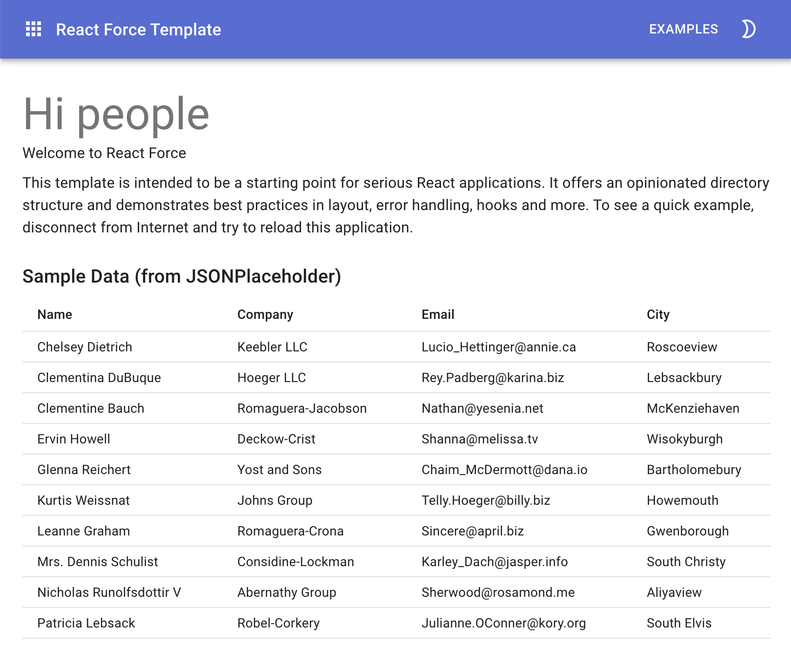

# React Force Template

This template is intended to be a starting point for serious React applications.
It offers an opinionated directory structure and demonstrates best practices in
layout, error handling, hooks and more.



Check out the following repos for more complex examples using this template:

-   [Stock Charts](https://github.com/nareshbhatia/stock-charts)
-   [Manage My Money](https://github.com/nareshbhatia/manage-my-money)
-   [GraphQL Bookstore](https://github.com/nareshbhatia/graphql-bookstore)

## Getting Started

```bash
$ yarn
$ yarn start
```

Now point your browser to http://localhost:3000/.
